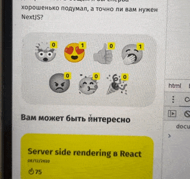

# aws-lambda-reactions

Example of using **AWS Lambda** + **Typescript** for site reactions. You can see live demo in https://amorgunov.com/posts/2020-04-12-use-redux-with-react-hooks/ on bottom of the post: 



### Usage

todo:

### Test requests

Get reactions for post:

```bash
curl -X GET "http://localhost:3000/posts/2020-04-12-use-redux-with-react-hooks/likes"
```

Set reaction to post:

```bash
curl -X POST -d "{\"reactionId\":\"love\"}" "http://localhost:3000/posts/2020-04-12-use-redux-with-react-hooks/likes"
```
